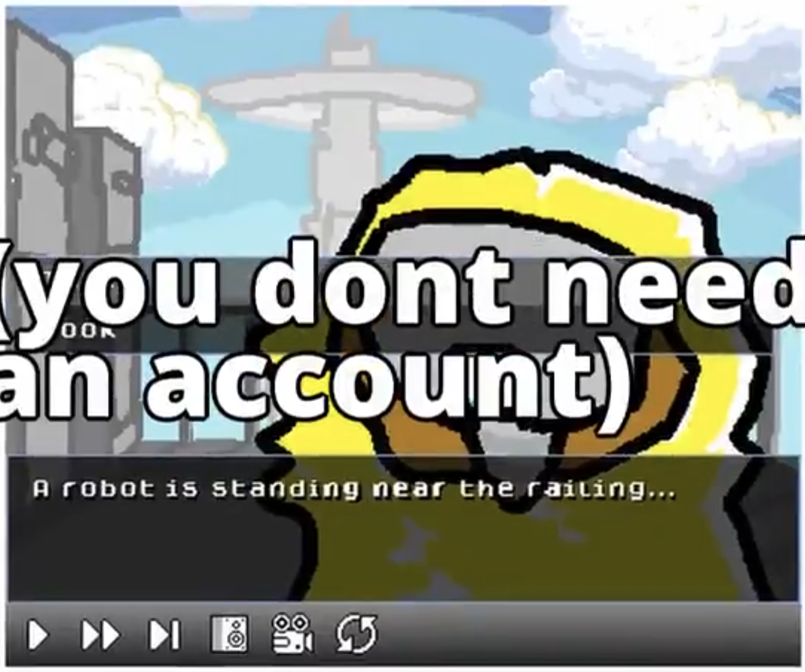

Game framework in C that compiles to WASM for lightweight 2D games.

my own visual novel engine (like twine) that I make so I can avoid using a convenient and efficient UI and use it solely for weightgain romance stories I post on itch.io and it has a retro UI like this 

**Scenes:** all the dialogue and pictures and stuff

**Transitions:** Have these properties...
- label text when selecting
- the two scenes they transition from/to
- the flag (boolean) requirements for it to appear as an option to select at all
- the flags it sets/unsets by using it

You can create situations where you're only able to reach a scene after completing other scenes first. It's not insanely powerful, but it allows for stories more complex than simple dialogue trees.

## Installation

1. GameKitty relies on Emscripten, SDL2, and SDL2 Image. These can be installed __on Mac/Linux__ with the following commands:

```
brew install emscripten
brew install sdl2
brew install sdl2_image
```

2. Then, set up the build environment.

```
cd <folder you want to be your build environment>
git clone https://github.com/dairycultist/GameKitty
cd GameKitty
```

3. Finally, build and launch the demo game.

```
sudo make run
```

## Uploading to Itch.io

After building, go into the `build` folder and zip `index.html`, `index.js`, and `index.wasm` together. This zip is what you will upload to Itch.io. Remember to check `This file will be played in the browser` on the uploaded file.

*Optional but recommended:* On the Itch.io edit page, under `Embed options > Viewport dimensions`, set the width/height to 512x384.

## Copyright

GameKitty is licensed under Apache License, Version 2.0. **The only files that fall under this license are** `game_kitty.c` `game_kitty.h` **and** `logo.png`**.** All other files are CC0.
